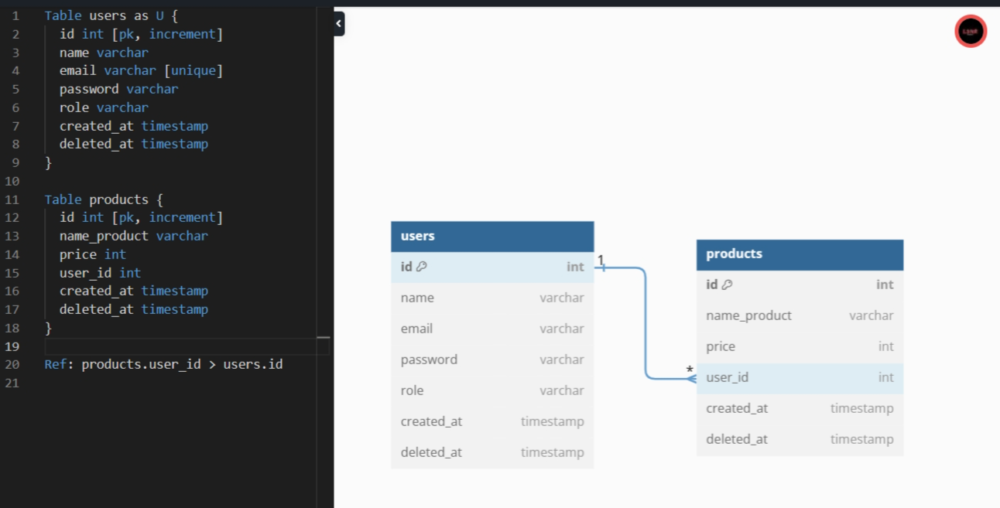
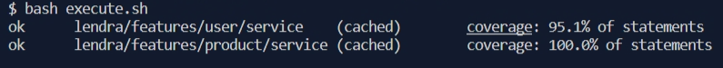

# Backend Test

## 📑 Tentang Proyek
Proyek ini adalah aplikasi web yang dibangun menggunakan bahasa pemrograman **Golang**, dan menggunakan framework **Fiber**, dan **GORM** dengan clean architecture. Aplikasi ini menggunakan **JWT** untuk otentikasi dan **cookies** untuk manajemen sesi. Dan data disimpan dalam database **MySQL**.

## 🛠️ Teknologi Stack
- **Golang**: Bahasa pemrograman yang digunakan untuk mengembangkan backend aplikasi.
- **Fiber**: Framework web Go yang digunakan untuk membangun API.
- **GORM**: Pustaka ORM (Object-Relational Mapping) untuk Go yang memudahkan interaksi dengan database.
- **MySQL**: Sistem manajemen basis data relasional yang digunakan untuk menyimpan data aplikasi.
- **JWT (JSON Web Token)**: Standar industri untuk token akses yang digunakan untuk otentikasi dan otorisasi.
- **Cookies**: Digunakan untuk manajemen sesi pengguna.
- **Mockery**: Alat untuk otomatisasi pembuatan mock object

## ERD 


## 🧪 Unit Testing
Unit testing dilakukan menggunakan library `testing` yang disediakan oleh Go dan library `mockery` untuk membuat mock object. Coverage:


## 🚀 Cara Menjalankan Proyek
Berikut adalah langkah-langkah untuk menjalankan proyek ini di lingkungan lokal Anda:

1. Clone repositori ini `git clone `.
3. Set file konfigurasi `local.env` dan dan sesuaikan database nya.
4. Jalankan server menggunakan perintah `go run main.go`.

## 🗺️ Struktur Proyek
Berikut adalah struktur direktori dan file proyek ini:

- `backend/`: Direktori utama proyek.
    - `features/`: Direktori ini berisi semua fitur aplikasi, seperti user dan product.
        - `user/`: Direktori ini berisi semua file yang berhubungan dengan fitur user.
            - `data/`: Direktori ini berisi file yang berhubungan dengan data user.
            - `handler/`: Direktori ini berisi file yang berhubungan dengan handler user.
            - `service/`: Direktori ini berisi file yang berhubungan dengan service user.
        - `product/`: Direktori ini berisi semua file yang berhubungan dengan fitur product.
            - `data/`: Direktori ini berisi file yang berhubungan dengan data product.
            - `handler/`: Direktori ini berisi file yang berhubungan dengan handler product.
            - `service/`: Direktori ini berisi file yang berhubungan dengan service product.
    - `utils/`: Direktori ini berisi utilitas yang digunakan di seluruh aplikasi, seperti enkripsi dan middleware.
- `router.go`: File ini berisi semua rute aplikasi.

## 📚 Dokumentasi API
Berikut adalah daftar endpoint API yang tersedia:

### 👤 User
- `POST /login`: Endpoint untuk login user.
- `POST /logout`: Endpoint untuk logout user.
- `POST /refresh-token`: Endpoint untuk refresh token.
- `POST /users`: Endpoint untuk registrasi user baru.
- `GET /users`: Endpoint untuk mendapatkan detail user.
- `PUT /users`: Endpoint untuk memperbarui data user.
- `DELETE /users`: Endpoint untuk menghapus user.
- `PUT /change-password`: Endpoint untuk mengubah password user.

### 🏠 Product
- `POST /product`: Endpoint untuk membuat product baru.
- `GET /product`: Endpoint untuk mendapatkan semua product.
- `GET /product/:id`: Endpoint untuk mendapatkan detail product berdasarkan ID.
- `PUT /product/:id`: Endpoint untuk memperbarui data product berdasarkan ID.
- `DELETE /product/:id`: Endpoint untuk menghapus product berdasarkan ID.

### 👮‍♂️ Admin
- `POST /admin/user`: Endpoint untuk admin membuat user baru.
- `GET /admin/user`: Endpoint untuk admin mendapatkan semua user.

## Detail API

***Note*** : Karena Aplikasi ini menggunakan cookie untuk manajemen sesi pengguna. Saat pengguna melakukan login, aplikasi akan mengatur cookie `access_token` dan `refresh_token` di browser pengguna. Cookie ini digunakan untuk otentikasi dan otorisasi pengguna pada permintaan yang memerlukan login jadi tidak perlu menggunakan Auth Bearer Token lagi, tetapi jika anda ingin mencoba memasukkan `access_token` nya di Auth Bearer Token masih tetap bisa. 

Penting untuk diingat bahwa cookie ini bersifat `HTTPOnly`, yang berarti mereka tidak dapat diakses melalui JavaScript di sisi klien. Ini adalah langkah keamanan untuk mencegah serangan seperti cross-site scripting (XSS) yang dapat mencuri cookie pengguna.

Jika Anda menguji API menggunakan perangkat seperti Postman, pastikan untuk mengaktifkan opsi yang memungkinkan cookie otomatis agar sesi pengguna dapat dipertahankan di antara permintaan.

Berikut adalah daftar endpoint API yang tersedia beserta detail request body-nya:

### 👤 User
- `POST /login`: Endpoint untuk login user.
  - Request body:
    ```json
    {
      "email": "string",
      "password": "string"
    }
    ```
- `POST /logout`: Endpoint untuk logout user. Tidak memerlukan request body.
- `POST /refresh-token`: Endpoint untuk refresh token. Tidak memerlukan request body. Memerlukan access-token di Bearer Token.
- `POST /users`: Endpoint untuk registrasi user baru.
  - Request body:
    ```json
    {
      "name": "string",
      "email": "string",
      "password": "string"
    }
    ```
- `GET /users`: Endpoint untuk mendapatkan detail user. Tidak memerlukan request body.
- `PUT /users`: Endpoint untuk memperbarui data user.
  - Request body:
    ```json
    {
      "name": "string",
      "email": "string"
    }
    ```
- `DELETE /users`: Endpoint untuk menghapus user. Tidak memerlukan request body.
- `PUT /change-password`: Endpoint untuk mengubah password user.
  - Request body:
    ```json
    {
      "old_password": "string",
      "new_password": "string"
    }
    ```

### 🏠 Product
- `POST /product`: Endpoint untuk membuat product baru.
  - Request body:
    ```json
    {
      "name_product": "string",
      "price": "integer"
    }
    ```
- `GET /product`: Endpoint untuk mendapatkan semua product. Tidak memerlukan request body.
- `GET /product/:id`: Endpoint untuk mendapatkan detail product berdasarkan ID. Tidak memerlukan request body.
- `PUT /product/:id`: Endpoint untuk memperbarui data product berdasarkan ID.
  - Request body:
    ```json
    {
      "name_product": "string",
      "price": "integer"
    }
    ```
- `DELETE /product/:id`: Endpoint untuk menghapus product berdasarkan ID. Tidak memerlukan request body.

### 👮‍♂️ Admin
- `POST /admin/user`: Endpoint untuk admin membuat user baru.
  - Request body:
    ```json
    {
      "name": "string",
      "email": "string",
      "password": "string"
    }
    ```
- `GET /admin/user`: Endpoint untuk admin mendapatkan semua user. Tidak memerlukan request body.
